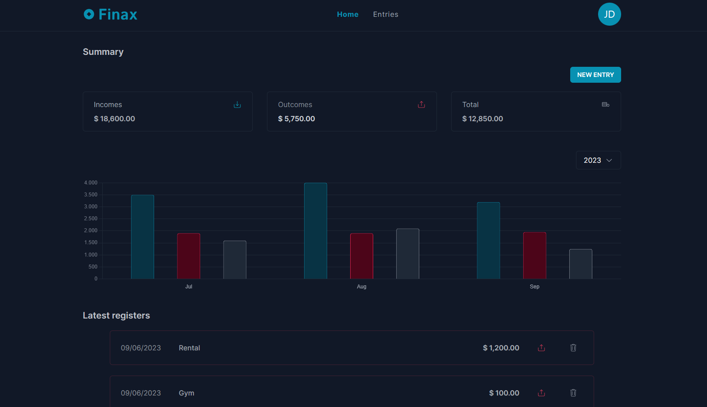

<p align="center">
  
</p>

<p align="center">
  
</p>

<strong align="center">
  With a combination of the word "finance", which refers to the management of money, and the word "maximize", which means to make the most of something, the Finax is a personal finance control app that aims to help people maximize their finances and make the most of their money.
</strong>

\
&nbsp;

> [!NOTE]
> 👉🏻 Access: [https://belapferreira.github.io/finax/](https://belapferreira.github.io/finax/)

\
&nbsp;

<p align="center">
  

  

  
</p>

<p align="center">
  <a href="#features">Features</a>&nbsp;&nbsp;&nbsp;|&nbsp;&nbsp;&nbsp;
  <a href="#heavy_check_mark-settings">Settings</a>&nbsp;&nbsp;&nbsp;|&nbsp;&nbsp;&nbsp;
  <a href="#arrow_down_small-cloning-the-repository">Cloning the repository</a>&nbsp;&nbsp;&nbsp;|&nbsp;&nbsp;&nbsp;
  <a href="#beginner-starting-the-application">Starting the application</a>&nbsp;&nbsp;&nbsp;|&nbsp;&nbsp;&nbsp;
  <a href="#wrench-techs--tools--resources">Techs | Tools | Resources</a>&nbsp;&nbsp;&nbsp;|&nbsp;&nbsp;&nbsp;
  <a href="#memo-license">License</a>
</p>

### Context

The Finax app was developed as a way to apply and fix the knowledge that I studied about TailwindCSS and Redux Toolkit practically.

I'm more familiar with React, so I've picked this library to develop the interface, using the Next.js framework. Currently, the React team recommends choosing one of the frameworks popular in the community:

> If you want to build a new app or a new website fully with React, we recommend picking one of the React-powered frameworks popular in the community. Frameworks provide features that most apps and sites eventually need, including routing, data fetching, and generating HTML.

I've used TypeScript because you can save time by avoiding bugs due to typos and other errors, it offers faster performance and the IntelliSense works better, generating a superior developer experience.

And for some components I've chose the Radix UI because its optimization related to accessibility.

### Features

- Add a entry;
- Remove a entry;
- Save entries registered in the local storage;
- Responsive page.

### :heavy_check_mark: Settings

The settings to execute the application on your computer are listed below.

- [Git](https://git-scm.com);
- [Node](https://nodejs.org/);
- [Yarn](https://yarnpkg.com/).

### :arrow_down_small: Cloning the repository

1. Through the terminal, go to the directory where you want to have the repository cloned and run the following command:

```bash
# cloning the repository
git clone https://github.com/belapferreira/finax
```

### :beginner: Starting the application

1. Through the terminal, go to the directory where the repository was cloned and run the following command:

```bash
# installing dependencies
yarn install

# starting application
yarn dev
```

### :wrench: Techs | Tools | Resources

This project was developed using the following resources:

[Eslint](https://eslint.org/) | [Next.js](https://nextjs.org/) | [Prettier](https://prettier.io/) | [Radix UI Tabs](https://www.radix-ui.com/primitives/docs/components/tabs) | [React Chart 2](https://react-chartjs-2.js.org/) | [React Icons](https://react-icons.github.io/react-icons/) | [Redux Toolkit](https://redux-toolkit.js.org/) | [Tailwindcss](https://tailwindcss.com/) | [TypeScript](https://www.typescriptlang.org/) | [Uuid](https://github.com/uuidjs/uuid)


### :memo: License

This project is under MIT license. See [LICENSE](https://github.com/belapferreira/finax/blob/master/LICENSE) for more information.

---

Developed by Bela Ferreira :blue_heart: Contact: https://www.linkedin.com/in/belapferreira :blush:
